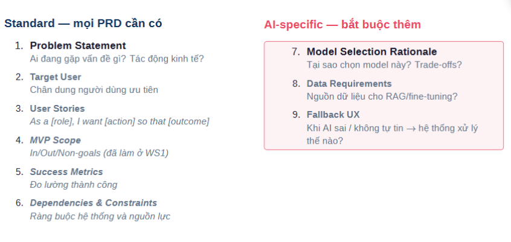

Làm sao để giảm pendtest trong hệ thống voc hiện tại ? 
In-Scope: 
Có thể nghe được người dùng nói và bắt đầu được cuộc trò chuyện trôi chảy theo một chủ đề cụ thể. 
Out of scope: 
- AI sàng lọc ra những lỗi của người dùng khi nói chuyện và recommend họ theo hướng tốt hơn. 
Non-Goals: 
- Dạy kiến thức về tiếng trung 
- Phổ cập nội dung hay đa dạng các nội dung như đọc / viết. 
Làm sao để biết có một thứ đáng làm hay không ? 

Mình phải có các success metrics cho sản phẩm của mình để nó có thể đo lường được MVP của mình có GẦN hơn với PAIN của người dùng không. 

=> Rèn luyện trực giác về việc nhận diện điểm đau của .... 
+ Đủ đau để trả tiền không ? 
+ Khả năng làm ra là bao nhiêu ? 
+ Làm bao nhiêu là đáng ? Nhận bao nhiêu là đủ ? 

Problem: 
Người học tiếng trung đang thiếu môi trường để luyện phản xạ tiếng trung. 
Target User: 
Người đang phải học phản xạ nói tiếng trung cấp tốc trong 3-5 tháng. 
User story 1: As a chinese learner, i want to have a 24/7 chinese teacher so that i can practice speaking skills as fast as posible. 
User story 2: As a chinese learner, i want to have a simple app which can transcipt my words so that i can review my grammar / comprehensive 

AI-Specific 
Model selection: 
ASR để nghe người dùng nói - Dùng whisper 
LLM để điều khiển hội thoại và sửa lỗi 
TTS hoặc speech to speech để trả lời bằng giọng nói tự nhiên 
Data Source: 
Audio tiếng Trung kèm transcript: để ASR nghe đúng người học nói gì. 
Audio hội thoại / câu luyện nói để tạo bài practice sát nhu cầu người học, thay vì chỉ dùng câu ngẫu nhiên.
Dữ liệu lỗi người học Việt Nam nếu bạn muốn chấm phát âm, sửa lỗi, và gợi ý bài tập theo đúng kiểu người Việt hay sai.
Dữ liệu hành vi học tập như câu nào user hay sai, bỏ qua, luyện lại nhiều lần, để cá nhân hóa trải nghiệm.

Riskiest Assumption: 
- Người học tiếng Trung sẽ thích và dùng thường xuyên một robot để luyện nói -> đủ để thành thói quen học thật, chứ không chỉ là món đồ công nghệ thú vị lúc đầu. 
Tại sao ? Vì mình đang kiểm tra hành vi dùng lặp lại. -> Robot có thể ngầu nhưng nếu không tạo thói quen nói thì không có pain. 
Hypothesis: 
Aha moment của sản phẩm là khi người dùng vừa về nhà, robot nhận diện được họ, chủ động chào bằng tiếng Trung, nhắc lại một chi tiết từ hôm qua, và giữ được một cuộc hội thoại ngắn 3–4 lượt.