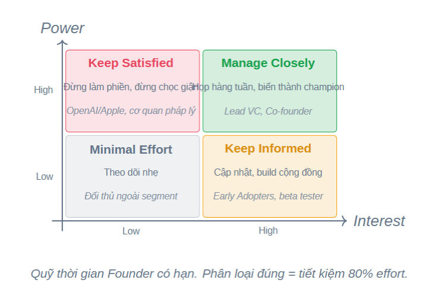
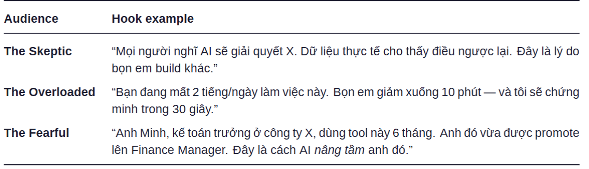
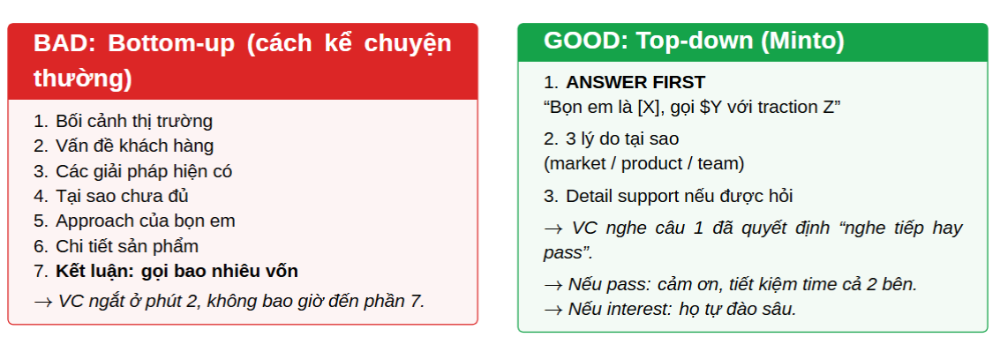

ảo tưởng -> sai lớn hơn nếu không nhìn ra độ khó thực sự của bài toán
user không mua tính năng, họ mua design outcome
founder đúng họ pitch roi bằng một số liệu cụ thể 
user thật thì họ sẽ kể chuyện -> kỹ năng này -> thuyết phục người khác tin vào tầm nhìn của mình. -> thể hiện mức độ sâu và tâm huyết. 
bản đồ hệ sinh thái -> biết được chân dung của mỗi người mà mình đang pitching. Với mỗi người là sẽ có chân dung khác nhau và có những câu chuyện khác nhau. 
**-- bài học sẽ đưa ra đủ 8 chân dung khác nhau**
bán sản phẩm cho những user đầu tiên. -> vì họ hoài nghi vì mình chưa thành công, chưa ai dùng, chưa case-study. 
> --- gợi ý 1 phương pháp: tâm lý học 
> 
> 
Twitter Pitch: Làm sao có thể bán được 1 startup trong vòng 250 ký tự ( twitt )
Thực hành: Đấu khẩu trực tiếp với AI VC để hiểu rõ về dự án của mình. 

# Trong giới startup, ai có thể giết chết dự án của bạn ?
Stakeholder : người có ảnh hưởng hai chiều với startup của mình. 
Một vài stakeholder phổ biến: 
Co-founder -> giết chết bằng rời bỏ, lấy ip : equity, vision, control
Lead VC -> không follow-on round : return, milestones
ví dụ: họ cho mình tiền là 50k để chạy runway, nhưng sau đó họ không muốn follow thì mình lại mất tiền để chạy. Khi một quỹ vào thì mình sẽ có sức ép phải chạy. Hụt hơi là họ rời đi ngay 
Early Adopters: review xấu Reddit/X : lifestyle, ease of use 
ví dụ: họ dùng sản phẩm của mình ở giai đoạn early tại thời điểm đó sản phẩm của mình rất tệ và họ không thích điều đó. Chỉ cần 1 user họ vào comment sản phẩm tệ không như quảng cáo -> thay đổi branding sản phẩm trong mắt community. 1 comment thì có thể sẽ có tới 100 người.
Foundation Model API -> Khóa API Account : Compliance, ToS 
vd: vì họ có rất nhiều giá trị cho nên họ không cần khách hàng. 
Báo chí -> đưa tin tiêu cực : Story, drama : Trường hợp này không phổ biến lắm, và chỉ dành ở các DN có quy mô nhất định rồi. 
Ví dụ : Zalo có 10 triệu người dùng, trong đó 1 triệu người ghét -> với cường độ cao này nó mới đẩy báo chí. Báo chí cường độ hóa lên vấn đề -> gây hoang mang -> ảnh hưởng đến khách hàng. 
Insight: Bản chất mình không vi phạm, nhưng sản phẩm của mình. Ví dụ: dự án Nuôi em không hề có giai phạm trong quy trình, nhưng do không có hệ thống minh bạch nên bị báo chí giật gân. 
Cơ quan pháp lý -> tuýt còi privacy : quy định, dữ liệu : này mà sai một cái thì cũng đi toi ngay nên chú ý và cập nhật ngay từ đầu. 

Question: Mình quản lý nhóm đó thế nào ? 
Phân loại thành 4 nhóm:

Ít nhất phải dành 80% cho LeadVC, Co-founder -> quan tâm cao và quyền cao
Đừng chọc giận OpenAI/Apple, cơ quan pháp lý -> quyền cao nhưng quan tâm thấp
Keep informed: Quyền hạn thì thấp nhưng có quan tâm cao ( mình đang giải quyết vấn đề của họ ). Đây là lực lượng khởi nghĩa
Minimal Effort: Theo dõi nhẹ với các đối thủ ngoài segment. 
Quỹ thời gian của founder rất ít và quý giá cho nên mình hãy phân loại và sử dụng thật quý giá. Nên chọn quan tâm cái gì trước và cái gì sau. 

=> AI cũng có khả năng giết chết sản phẩm của mình. 

Manage Closely / trùm cuối : Đang đi sâu vào phần stakeholder có high power + high interest 
Board members: Pre-board prep, no surprises. 
> Board members: Thành viên hội đồng quản trị – những người có quyền lực cao, ảnh hưởng lớn đến định hướng và quyết định chiến lược của startup.
> Pre-board prep: Chuẩn bị kỹ lưỡng trước mỗi cuộc họp hội đồng quản trị (board meeting). Founder cần chuẩn bị tài liệu, số liệu, các vấn đề quan trọng, phương án giải quyết… để trình bày rõ ràng, mạch lạc.
> No surprises: Không để xảy ra “bất ngờ” trong cuộc họp. Tức là, các vấn đề lớn, rủi ro, thay đổi quan trọng nên được trao đổi trước với các thành viên chủ chốt, tránh để họ bị “sốc” hoặc bất ngờ khi họp.
Strategic Partner: QBR, Joint Roadmap 
```python
QBR (Quarterly Business Review): Cuộc họp đánh giá kinh doanh hàng quý – hai bên sẽ cùng ngồi lại mỗi quý để xem xét kết quả hợp tác, giải quyết vấn đề, điều chỉnh mục tiêu nếu cần.
```
```python
Joint Roadmap: Lộ trình phát triển chung – hai bên cùng xây dựng và cam kết thực hiện một kế hoạch phát triển sản phẩm/dịch vụ hoặc hợp tác dài hạn.
```
Lead Investor: Nên có những cập nhật hàng tuần một cách chủ động, cần cho họ biết mình đang chạy như thế nào, có khó khăn, điểm tốt chưa tốt nào để hiểu thực sự rõ. 

Co-founder : Nên san sẻ những quyết định hàng tuần và làm sao để người đó có cảm giác / cùng nhau giao quyền. 

Một founder mạnh là luôn trung thực với chính bản thân mình, và trung thực với các stakeholder liên quan đến startup này. 

Keep satisfied - High Power + low interest - nguy hiểm nhất vì bạn dễ quên họ 
Bám sát các ToS và fallback model, các policy của Appstore / google play khi tạo, các cơ quan pháp lý KYC, Privacy policy. 

Keep informed: low power ( cá nhân ) + high interest - nhưng tập thể có quyền lực lớn. 
Early adopters : Discord riêng, weekly update : sản phẩm giải pain của họ -> chú trọng feeback và quan tâm vào lời nói của họ, họ thích cá tính năng mới.  
Beta testers: Feedback có trọng lượng và nên có chi trả trực tiếp cho họ. 
Tech Twitter / X : họ care vì theo dõi xu hướng AI.
Cách build community: là build - in - public  ( chia sẻ toàn bộ quá trình mình build app - dễ cho user cảm giác là họ sở hữu sản phẩm nó) -> có thể lên các cộng đồng buildinpublic để xem. 

Bad và Good Stakeholder Management 
Tệ là làm 1 kiểu communicate cho nhiều người 
Tốt là mỗi một đối tượng cần biết họ muốn biết gì và cung cấp thông tin vừa đủ tương ứng
Founder nên dành 60% time cho 20% stakeholder quan trọng nhất. 


# Bán app cho early adopters 
Tại sao user không dùng app của mình. 
Các lý do chính: 
- Switching cost: dùng quen một thứ, làm đã tốt thì không có lý do gì để chuyển đổi. 
- Trust deficit : startup này tồn tại được bao lâu, dữ liệu có an toàn không ? 
- Friction onboarding : phải đăng ký, chọn plan, verify -> gây quá nhiều ma sát -> mệt mỏi từ ban đầu -> bỏ cuộc cho tới lúc họ thấy được outcomes mà mình mang lại 
- Fear of replacement: 

### ADKAR: Framework bẻ khóa tâm lý người dùng

ADKAR gồm 5 bước giúp dẫn dắt user từ biết đến, sử dụng và trung thành với sản phẩm:

1. **Awareness** (Nhận thức)
	- User biết đến sự tồn tại của sản phẩm (qua marketing, campaign...)
2. **Desire** (Mong muốn)
	- Tại sao tôi lại quan tâm? Đây là bước khó nhất: phải tạo cho user mong muốn sử dụng sản phẩm (kể chuyện, WIIM: What's In It for Me)
3. **Knowledge** (Hiểu biết)
	- User cần biết sản phẩm hoạt động thế nào, lúc này mới quan tâm đến tính năng, hướng dẫn...
4. **Ability** (Khả năng sử dụng)
	- User có dùng được không? Họ phải sử dụng được sản phẩm mà không gặp rào cản kỹ thuật
5. **Reinforcement** (Củng cố)
	- Sau khi dùng rồi, làm sao để user quay lại, tiếp tục sử dụng thường xuyên?

➡️ ADKAR là quá trình giúp user biết đến, trải nghiệm và gắn bó với sản phẩm của bạn.

Một số lỗi phổ biến: 
Mọi người thường skip từ Awareness đến thẳng Ability. -> skip desire và knowledge là họ thoát luôn, vì họ chẳng hiểu tại sao phải cần nó. 


# Ba kiểu user khó tính nhất 
1. Kiểu người hoài nghi -> tắt ở : Trust -> chỗ thua: Awareness -> desire
2. Người quá tải -> tắt ở : Time -> Chỗ thua: Knowledge -> ability -> quá xa xỉ về mặt thời gian 
3. Người sợ hãi -> tắt ở: Identity -> chỗ thua: Desire ( sợ hơn muốn )

### Cách xử lý với người hoài nghi  
1. Acknowledge: Đồng ý với ý kiến cá nhân của người dùng .. -> cho user hiểu là mình hiểu vấn đề của họ, mình phải giải quyết vấn đề. 
2. Human-in-the-loop: Cần đưa ra yếu tố là người cũng kiểm tra. 

### Cách xử lý với người quá tải 
1. Trực tiếp cho họ vào trải nghiệm để đạt Aha Moment trước. 
2. Thời gian đến Aha Moment tầm dưới 1 phút thôi. 

### Cách xử lý với người có nỗi sợ 
1. AI sẽ không thay thế người 
2. Người biết dùng AI sẽ thay thế người không dùng AI 
=> Dùng để đổi góc nhìn cho họ ( cối lõi vẫn tốt mà )



# Block 3 : Viết 250 câu về startup của bạn dể pitch desk 
VC quan tâm đến: 
1. Tagline 
2. Problem + Solution 
3. 

## Minto Pyramid: 
McKinsey là đơn vị tư vấn kinh doanh hàng đầu thế giới
*Lật ngược thứ tự kể chuyện = tôn trọng time của người nghe
*


Nên nói về tiền ngay từ đầu -> họ sẽ biết là có nên nghe hay không rồi. Nói thẳng ra cái mình làm xem có hợp khẩu vị của họ ngay từ đầu luôn. 
=> Tiết kiệm thời gian của người nghe
Luồng bottom - up thì nên cho họ một file riêng biệt để họ xem nếu họ có ít thời gian. 

# SCQA / Cấu trúc mở bài chuẩn Minto 
Situation: Bối cảnh ai cũng đồng ý ( không tranh cãi )
Complication: Biến cố / Pain - " Nhưng vấn đề là ... "
Question : Câu hỏi treo ở đầu của người nghe 
Answer: Giải pháp của bạn ( Đây là tagline startup )
Nói 4 câu trên trong 30s thôi -> từ đó VC mới biết là câu này có hợp khẩu vị của họ hay không rồi. 

### Có template twitter pitching : mình có thể kham khảo
Seed VC -- Thích vision lớn - tăng trưởng nhanh thì cần vốn, có các round thì tìm angel invester để xin 50k đô, dung size chỉ từ 10k - 50k đô. Quỹ pre seed là 100k đô để làm, họ sẽ quan tâm là tăng trưởng có đủ chỉ số để vào vòng tiếp theo không ? Qua mỗi vòng thì dung sai đầu tư tiền sẽ lớn hơn, họ quan tâm cái startup này có đến được vòng seed hay không ? Có những quỹ ở vòng pre-seed làm đến một mức độ đến seed rồi thì sẽ bán cho ở quỹ ở vòng seed, rồi các quỹ ở vòng seed làm rồi thì sẽ bán đến quỹ series A để bán. Trọng tâm là biết mình nằm ở vòng nào để gọi quỹ ở vòng đấy ( hiểu mình để hiểu chân dung quỹ ) 
Series A VC -- Thích metrics 

# Data Flywheel note-taking

More Users: Professionals use your app to practice Chinese scenarios (e.g., a factory tour).

More Data: Every interaction captures specific "edge cases"—the exact mistakes Vietnamese speakers make or the specific industry slang they need.

Better Model: You use that specific data to fine-tune your AI. It becomes more "localized" and "nuanced" than a general model like GPT-4.

Better Product: The app now understands the user perfectly. This attracts More Users, and the cycle restarts.
