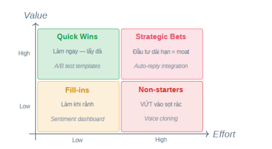

Hôm nay học làm gì trước làm gì sau và đo thế nào sau khi đã có tiền. 
Đo bằng output và đo bằng outcome
Đo bằng output là đo bằng những việc mình đã làm, các chỉ số, specific và fancy nhưng không thể hiện được giá trị của mình. 
Ví dụ: Em code 10000 dòng mỗi ngày, em ship được 12 tính năng mỗi ngày. 
Nhưng với outcome thì khác: 
ví dụ: User tiết kiệm 1,7 giờ ngày 
# > # Mình nên tập cách nhìn mọi thứ bằng outcome của công việc mà nó mang lại. 
Ngôn ngữ của business là ngôn ngữ outcome. 
Khi mình làm việc rất là năng suất nhưng nghĩ mãi không thấy outcome nó là gì thì đó là output sai chỗ 

4 framework sống còn 
Today's Spine 
block 1: Chọn hành trang - Làm gì trước
block 2: vẽ bản đồ - sắp xếp thế nào 
block 3: đặt cột mốc - Đo bằng gì OKRs 

block 4: cạm bẫy ký sinh - rủi ro ở đâu 

# Chọn hành trang
nếu mình có 100 ý tưởng nhưng có 5M thì nên chọn cái nào để làm. -> chọn thứ có đòn bẩy -> làm sao để biết nó có đòn bẩy
Làm sai thì tốn thời gian + tiền bạc + effort. 
Ví dụ thực tế: Khi mà chọn idea thì nó rất nhiều việc phải làm -> cái runway sẽ ngắn đi rất là nhiều. Viễn tưởng là 3 tháng là có user sử dụng nhưng thực tế là đến 7 tháng mới có người sử dụng. Nên hãy tập trung vào xem quality của nó là như thế nào. 
# Idea Overload - căn bệnh phòng họp 
Khi có quá nhiều ý tưởng -> nếu không thực sự biết chọn -> người nói to nhất là người thắng. 
Cuối cùng thì lại làm không đến nơi đến chốn. 
Solution là RICE. 
Những gì cảm tính thì tạo nên cãi vã còn toán học thì tạo nên quyết định. 
(Reach x impact x confidence)/ effort = RICE score
R - reach : bao nhiêu user sẽ dụng tính năng này 
I - impact : tác động đến user mạnh cỡ nào 
(
     * **0.25 (Tiny):** Không làm thì gần như không ai nhận ra hoặc ảnh hưởng đến kết quả.
* **0.5 (Low):** Có cải thiện nhỏ nhưng không thay đổi hành vi hoặc outcome của user.
* **1 (Medium):** Giải quyết vấn đề rõ ràng cho một phần user hoặc cải thiện một metric đáng kể.
* **2 (High):** Tác động trực tiếp đến trải nghiệm cốt lõi hoặc kết quả chính của user.
* **3 (Massive):** Thay đổi căn bản cách sản phẩm tạo giá trị hoặc hướng đi của business.

)
C - confidence : Bạn tự tin về số R, I bao nhiêu %
E - Effort: Tốn bao nhiêu person - month ? 
Lưu ý: Confidence quan trọng nhất : Đa số founder cho 100% - nhưng chưa hỏi user nào.

Score chủ yếu để xem trọng lượng của danh sách ý tưởng -> ra quyết định dựa trên thực tế đã được tổng hợp từ số liệu 
Confidence thường là các chỉ số chưa test, đến từ quan điểm cá nhân của người dùng. 

Nhưng không phải điểm cao thì sẽ làm trước 
Làm thêm 1 bảng matrix 
Value - Effort 

Còn phải sắp xếp lại theo bảng năng lực cá nhân x high value. 

3 lỗi phổ biến khi chấm RICE 
1. Confidence ảo : nếu chưa từng test thì là 50% MAX 
2. Reach lạc quan: chỉ 20-40% user dùng tính năng mới sau khi launch -> always discount Reach by 50%. 
3. Effort underestimate: cộng QA + bug Fix + integration test = 1.5 - 2x estimate ban đầu -> always multiply effort by 1.5. 
